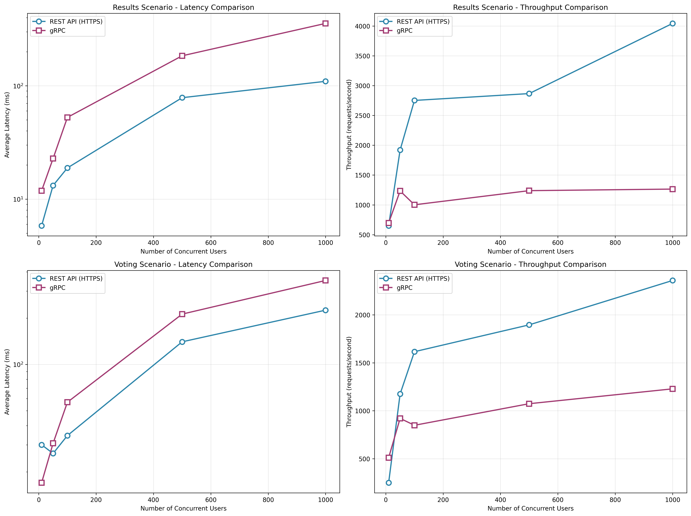

# Project Assignment 2 Report

2258-CSE-5306-004  
Name:

- John Song - 10023064679
- Adam Emerson - 1000773509

Github: [https://github.com/CSE-5306-004-DISTRIBUTED-SYSTEMS/Project2.git](https://github.com/CSE-5306-004-DISTRIBUTED-SYSTEMS/Project2.git)

## 1. System Overview

This system allows users to create polls and vote, with the results being aggregated across the distributed nodes.  
This system is designed to allow for the creation and management of polls across multiple, distributed nodes. It focuses on reliability and real-time result aggregation

#### Five Functional Requirements

- Create Poll: A user can create a new poll with a question and a set of options.
- Cast Vote: A user can vote for an option on a specific poll.
- Get Poll Results: A user can view the current vote counts for a specific poll.
- List All Polls: A user can see a list of all available polls.
- Close Poll: The creator of a poll can close it to prevent further voting.

## System Designs

### 2.1 Resource Based Architecture w/ HTTP (REST API)

The REST-based architecture implements a distributed polling system using HTTP communication and a resource-oriented design. The system consists of 5 containerized nodes:

**System Components:**

- **Frontend (React)**: User interface built with TypeScript and Tailwind CSS, running on port 3002
- **Load Balancer (NGINX)**: Distributes incoming requests evenly between API instances on port 3005
- **API Instances (2x Hono)**: REST-based microservices handling business logic on internal port 3000
- **Database (PostgreSQL)**: Single database instance storing all poll data on port 5432

**Communication Model:** HTTP/REST with JSON payloads

- Client-server communication via standard HTTP methods (GET, POST, PUT)
- Stateless request-response pattern
- JSON serialization for data exchange
- Load balancing for horizontal scaling

**How it supports the five functional requirements:**

1. **Create Poll**: `POST /polls` endpoint with poll metadata in JSON format
2. **Cast Vote**: `POST /polls/{id}/votes` endpoint with vote data
3. **Get Poll Results**: `GET /polls/{id}/results` endpoint returning aggregated counts
4. **List All Polls**: `GET /polls` endpoint returning all available polls
5. **Close Poll**: `PUT /polls/{id}/close` endpoint for poll creators

**Architecture Benefits:**

- Simple HTTP-based communication with wide tooling support
- Horizontal scalability through load balancing
- Stateless design enabling easy scaling
- Standard REST conventions for predictable API design

### 2.2 Microservice gRPC

1. Entry Point (1 Node)
   Component: Nginx Load Balancer

Role: Acts as the single entry point for all incoming client traffic. It uses a round-robin strategy to distribute gRPC requests evenly between the two application servers, preventing any single app server from becoming a bottleneck.

2. Application Logic (2 Nodes)
   Components: Two identical Python gRPC Servers

Role: These nodes execute the core business logic. They are responsible for handling requests for creating polls, casting votes, and retrieving results. By running two instances, the system achieves redundancy; if one app server fails, the Nginx load balancer will automatically route all traffic to the healthy one, ensuring the service remains available.

3. Data Store (2 Nodes)
   Components: Two PostgreSQL Databases configured in a Primary-Standby relationship.

Role: This layer provides a fault-tolerant data store.
Primary Database (db-primary): Handles all write operations (e.g., creating a poll, casting a vote) from the application servers.

Standby/Replica Database (db-replica): Receives a continuous, real-time copy of all data from the primary via streaming replication. Its main purpose is to be a hot backup, ready to be promoted if the primary fails. It can also be used to scale read operations.

**Communication Protocol**: gRPC is used for all communication, leveraging its high performance with HTTP/2 and binary Protobuf format.

## 3. Evaluation

Performance (latency, throughput) & Scalability.

$Latency = T_{response} - T_{request}$.

$Throughput = \frac{Total \space Requests}{Latency} $

### 3.0 Hardware

Tests were conducted on a Macbook Pro with the M2 Pro chip and 16gb of ram.

### 3.1 Experiement (write-heavy scalability) - Voting

This test simulates multiple users casting votes in a poll at the same time.

#### REST HTTPS Evaluation

| Total Users | Scenario | Avg Latency (ms) | Throughput (req/s) |
| ----------- | -------- | ---------------- | ------------------ |
| 10          | Voting   | 30.01            | 249.60             |
| 50          | Voting   | 26.36            | 1175.28            |
| 100         | Voting   | 34.45            | 1615.69            |
| 500         | Voting   | 140.42           | 1895.35            |
| 1000        | Voting   | 225.59           | 2357.78            |

#### Microservice gRPC Evaluation

| Total Users | Scenario | Avg Latency (ms) | Throughput (req/s) |
| ----------- | -------- | ---------------- | ------------------ |
| 10          | Voting   | 16.98            | 510.52             |
| 50          | Voting   | 30.68            | 920.67             |
| 100         | Voting   | 56.80            | 848.71             |
| 500         | Voting   | 212.70           | 1073.58            |
| 1000        | Voting   | 352.02           | 1228.48            |

### 3.2 Experiement (read-heavy scalability) - Showing poll results

This test simulates multiple users accessing poll results at the same time.

#### REST HTTPS Evaluation (Table 1)

| Total Users | Scenario | Avg Latency (ms) | Throughput (req/s) |
| ----------- | -------- | ---------------- | ------------------ |
| 10          | Results  | 5.83             | 650.32             |
| 50          | Results  | 13.20            | 1919.89            |
| 100         | Results  | 18.87            | 2751.93            |
| 500         | Results  | 78.59            | 2866.68            |
| 1000        | Results  | 109.58           | 4043.72            |

#### Microservice gRPC Evaluation (Table 2)

| Total Users | Scenario | Avg Latency (ms) | Throughput (req/s) |
| ----------- | -------- | ---------------- | ------------------ |
| 10          | Results  | 11.85            | 695.41             |
| 50          | Results  | 22.83            | 1233.66            |
| 100         | Results  | 52.67            | 1001.24            |
| 500         | Results  | 184.07           | 1238.45            |
| 1000        | Results  | 355.32           | 1264.62            |

## 4. Analysis of Test Results


(Figure 1)

Stress tests on the read and write performance of both architectures show a consistent advantage for the HTTPS-based REST system, which outperforms the gRPC implementation in nearly all metrics except for latency at very low user counts (Fig. 1). This outcome is counterintuitive, as gRPC typically offers superior efficiency due to its binary protocol and multiplexed streams.

To investigate the discrepancy, we examined architectural differences that could contribute to the observed slowdown. The gRPC setup uses an older version of PostgreSQL, which may impact query performance. More importantly, this system maintains a live backup instance, introducing additional replication overhead. These factors likely compound under higher loads.

Finally, the gRPC service was set to a `max_workers` value of `10`, likely creating a threading bottleneck, while the REST implementation operates with effectively unbounded asynchronous requests. This limitation likely accounts for the gRPC system’s elevated latency and reduced throughput as concurrency increases.

## 5. AI Usage

### 5.1 REST HTTPS Based Architecture

To develop the REST HTTPS Based architecture we made liberal use of AI through a coding agent, Cursor. Using pre-existing domain knowledge, we sketched out a system plan that outlined a general architecture, libraries we wanted to use, and the general project requirements. This outline was provided to the LLM and formalized into a more comprehensive plan of action.

From there, a pair-programming paradigm was adopted, where we would request the LLM to make changes to the code base, and then we would review the changes and approve, edit, or deny them and implement things manually.

Initially the AI agent tended to over-engineer and add features that were not requested or were beyond the scope of the assignment. Manual refactoring was done to simplify the codebase and we updated our prompting strategy to ensure the model produced simple output suitable for this class project.

The evaluation scripts were generated by the coding agent as well.

### 5.2 RPC Microservice Architecture

Using Prompt

```
let's build our distributed system as I mentioned before.
#### 2. Microservice gRPC
There are 5 nodes for this distributed systems.
**Nodes 1**: **Load Balancers**: These two nodes will be set up in a active-passive configuration. They are the single entry point for all client traffic. They distribute requests to the two servers. If one load balancer fails, the other can seamlessly take over. This prevents a single point of failure at the network edge.
**Nodes 2 & 3**: **Application Logic**: These two nodes will act as your application servers. Each node will run logics (Polls, Voting, Results). This creates redundancy and load distribution. If one of these servers fails, the other can continue to process all requests.
**Node 4 & 5**: **Database Server**: Application nodes (Nodes 1 and 2) will connect to this database to read and write data for storing voting, polling, and result table.
#### Technology Stacks
- Nginx
- Python
- gRPC
- PostgreSQL
```

## 6. Distribution of Workload

We collaborated initially on coming up with different system designs suitable for the project. Once two concepts were decided on, we worked largely indepedently. Adam developed the REST architecture and John took on the Microservice architecture. Finally, we merged our changes into the git repository and worked together on the evaluation section and the report.
